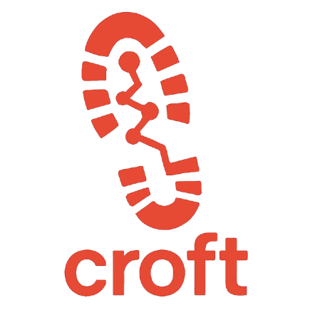
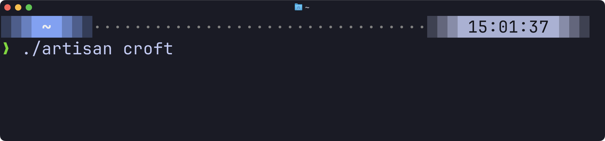

### MCP server specifically for local Laravel development
Artisan command provides tools to your MCP client to help your AI pair programmer work better.
This is specifically designed to offer tools that are useful _locally_.
Add more functionality with [croft.fyi »](https://croft.fyi) hosted servers

<p align="center">

</p>





## Installation

Install the package via composer:

```bash
composer require ashleyhindle/croft --dev
```

Publish the config file with:

```bash
php artisan vendor:publish --tag="croft-config"
```

Add more functionality with [croft.fyi »](https://croft.fyi) hosted servers (coming soon)

## Usage
To make use of Croft you need to add it as an MCP server in your favourite tool.

The command the MCP client needs to run is `./artisan croft`

**Cursor** ([Docs](https://docs.cursor.com/context/model-context-protocol#configuring-mcp-servers))

We recommend you ship an `mcp.json` file with your project in `.cursor/mcp.json`

```json
{
  "mcpServers": {
    "croft": {
      "command": "./artisan",
      "args": ["croft"]
    }
  }
}
```

## Current functionality
- Screenshot URLs
- InertiaJS docs
- Query database (read only, or read write)
- Get absolute URL from relative path
- Get current date and time
- Read last X log entries
- Read & filter database structure - tables, columns, indexes, foreign keys
- List/filter routes
- List artisan commands
- List available config() keys (and optionally values) in dot notation
- List available env() keys (without leaking secrets of course)

## Extra functionality
Add more functionality with [croft.fyi »](https://croft.fyi) remote MCP servers (coming soon).

## Add your own tools
It's trivial to add your own tools.

Just create a class that extends our `Croft\Feature\Tool\AbstractTool` class, then make sure it's in your `croft.php` config file.

Example:
```php
<?php

declare(strict_types=1);

namespace Croft\Tools;

use Croft\Feature\Tool\AbstractTool;
use Croft\Feature\Tool\ToolResponse;

class {{CLASSNAME}} extends AbstractTool
{
    public function __construct()
    {
        // Setup annotations according to MCP specification
        $this->setTitle('{{NAME}}')
            ->setReadOnly(true)        // Just listing commands, no modifications
            ->setDestructive(false)    // No destructive operations
            ->setIdempotent(true);     // Safe to retry
    }

    public function getName(): string
    {
        return '{{NAME}}';
    }

    public function getDescription(): string
    {
        return 'Must explain well what the tool can do so the MCP client can decide when to use it.';
    }

    /**
    * What params does the MCP client need to provide to use this tool?
    **/
    public function getInputSchema(): array
    {
        return [
            'type' => 'object',
            'properties' => (object) [
            ],
            'required' => [],
        ];
    }

    public function handle(array $arguments): ToolResponse
    {
        return ToolResponse::text("Howdy, this is the start of something great.");
    }
}
```

After adding a tool you'll need to restart the server, or ask the MCP client to relist the tools.

## Support & Credits

This was developed by Ashley Hindle. If you like it, please star it, share it, and let me know!

- [Bluesky](https://bsky.app/profile/ashleyhindle.com)
- [Twitter](https://twitter.com/ashleyhindle)
- Website [https://ashleyhindle.com](https://ashleyhindle.com)
